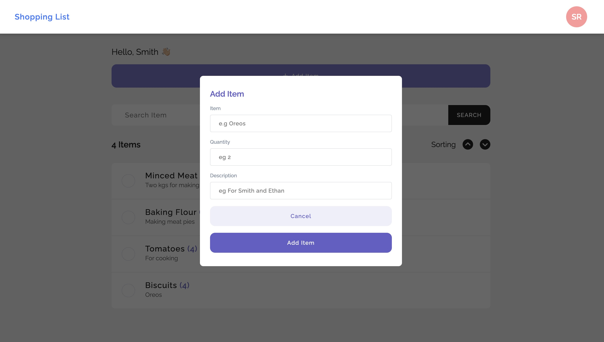

# Shopping List



This is a simple shopping list application created using React and hosted on Netlify. You can access the live application here: [Shopping List](https://shopping-todo.netlify.app/)

## Features

- Create a shopping list by adding items.
- Mark items as completed and modify other details.
- Delete items from the list.
- Responsive design that works well on both desktop and mobile devices.

## Usage

1. Visit the live application at [Shopping List](https://shopping-todo.netlify.app/).
2. To add an item to your shopping list, enter the item name in the input field and press "Add Item."
3. To mark an item as completed, click the checkbox next to the item.
4. To delete an item, click the "Delete" button next to the item.
5. Your shopping list will be saved, so you can return to it later.

## Development

If you want to run this application locally or modify it, you can follow these steps:

1. Clone this repository:

   ```bash
   git clone https://github.com/ringtho/shoppinglist-frontend
   cd shoppinglist-frontend
2. Install the dependencies:
    ```bash
   npm install
3. Start the development server:
    ```bash
    npm start
Open your web browser and navigate to http://localhost:3000 to view the application.

## Technologies Used
- React.js
- React Hooks
- React Router
- SCSS for styling


## Deployment
The application is hosted on Netlify. Deployment is set up to be automatic whenever changes are pushed to the main branch.

## License
This project is licensed under the MIT License.

## Acknowledgments
- Special thanks to the React community for providing a powerful and flexible library for building user interfaces.
- Icons from FontAwesome.


